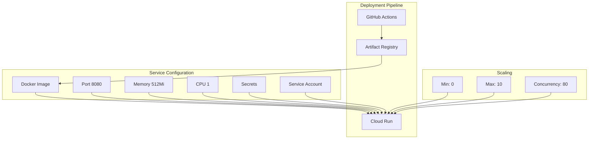
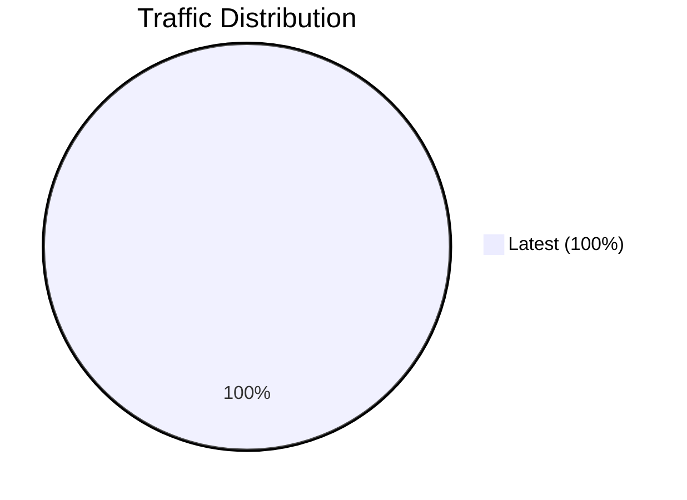
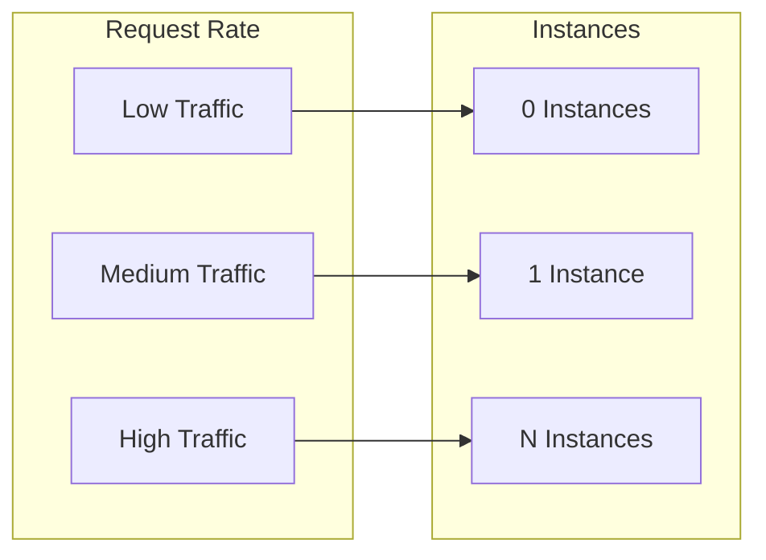
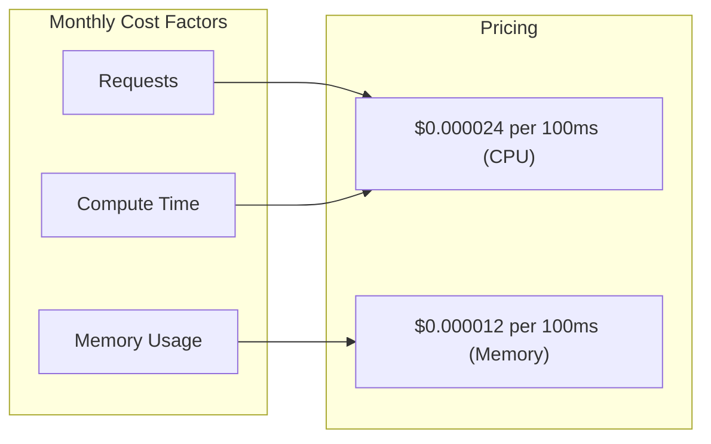

# Cloud Run Configuration Documentation

This document details the Cloud Run service configuration, deployment, and management.

---

## Overview



---

## Service Configuration

### Current Configuration

| Property | Value |
|----------|-------|
| Service Name | `fastapi-users-api` |
| Project ID | `integral-vim-494001-v4` |
| Project Number | `395887947282` |
| Region | `us-central1` |
| Platform | `managed` |

### Resource Allocation

| Setting | Value | Description |
|---------|-------|-------------|
| Port | `8080` | Container port |
| Memory | `512Mi` | Memory allocation |
| CPU | `1` | vCPU allocation |
| Timeout | `300s` | Request timeout |
| Max Instances | `10` | Maximum scaling |
| Min Instances | `0` | Minimum scaling (cost saving) |
| Concurrency | `80` | Requests per instance |

### URL and Traffic

| Property | Value |
|----------|-------|
| URL | `https://fastapi-users-api-395887947282.us-central1.run.app` |
| Ingress | `all` (public) |
| Authentication | `allow-unauthenticated` |

---

## Dockerfile

The application is containerized using a multi-stage Dockerfile:

```dockerfile
# Build stage
FROM python:3.12-slim as builder
WORKDIR /app
COPY requirements.txt .
RUN pip install --no-cache-dir --user -r requirements.txt

# Production stage
FROM python:3.12-slim
WORKDIR /app
COPY --from=builder /root/.local /root/.local
COPY . .
ENV PATH=/root/.local/bin:$PATH
CMD ["uvicorn", "app.main:app", "--host", "0.0.0.0", "--port", "8080"]
```

### Build Arguments

- **Base Image**: `python:3.12-slim`
- **User**: Non-root (rootless)
- **Port**: `8080`
- **Command**: `uvicorn app.main:app --host 0.0.0.0 --port 8080`

---

## Deployment Commands

### From GitHub Actions (Automatic)

The deployment happens automatically when tests pass on `main`:

```yaml
- name: Deploy to Cloud Run
  env:
    PROJECT_ID: ${{ secrets.GCP_PROJECT_ID }}
    REGION: ${{ vars.GCP_REGION || 'us-central1' }}
    SERVICE_NAME: ${{ vars.GCP_SERVICE_NAME || 'fastapi-users-api' }}
    IMAGE: us-central1-docker.pkg.dev/${{ secrets.GCP_PROJECT_ID }}/app-images/fastapi-users-api:${{ github.sha }}
  run: |
    gcloud run deploy "${SERVICE_NAME}" \
      --project="${PROJECT_ID}" \
      --region="${REGION}" \
      --platform=managed \
      --image="${IMAGE}" \
      --port=8080 \
      --memory=512Mi \
      --cpu=1 \
      --timeout=300 \
      --max-instances=10 \
      --min-instances=0 \
      --concurrency=80 \
      --allow-unauthenticated
```

### Manual Deployment

```bash
# Set variables
PROJECT_ID="integral-vim-494001-v4"
REGION="us-central1"
SERVICE_NAME="fastapi-users-api"
IMAGE="us-central1-docker.pkg.dev/${PROJECT_ID}/app-images/fastapi-users-api:latest"

# Deploy
gcloud run deploy "${SERVICE_NAME}" \
  --project="${PROJECT_ID}" \
  --region="${REGION}" \
  --platform=managed \
  --image="${IMAGE}" \
  --port=8080 \
  --memory=512Mi \
  --cpu=1 \
  --timeout=300 \
  --max-instances=10 \
  --min-instances=0 \
  --concurrency=80 \
  --allow-unauthenticated \
  --update-secrets=DATABASE_URL=fastapi-supabase-gcp-challenge:latest
```

---

## Container Configuration

### Environment Variables

| Variable | Source | Description |
|----------|--------|-------------|
| `DATABASE_URL` | Secret Manager | PostgreSQL connection string |
| `PYTHONUNBUFFERED` | System | Disable output buffering |

### Secrets Mounted

| Secret | Mount Method | Environment Variable |
|--------|-------------|---------------------|
| `fastapi-supabase-gcp-challenge` | `--update-secrets` | `DATABASE_URL` |

### Service Account

| Property | Value |
|----------|-------|
| Service Account | `395887947282-compute@developer.gserviceaccount.com` |
| Display Name | Default Compute Service Account |
| Role | (runtime execution) |

---

## Traffic and Scaling

### Traffic Split



Currently all traffic goes to the latest revision.

### Scaling Configuration

| Setting | Value | Behavior |
|---------|-------|----------|
| Min Instances | `0` | Scale down to zero when idle (cold starts) |
| Max Instances | `10` | Scale up to handle high traffic |
| Concurrency | `80` | Each instance handles 80 concurrent requests |
| Timeout | `300s` | Long-running requests allowed |

### Scaling Behavior



---

## Managing the Service

### View Service Status

```bash
gcloud run services describe fastapi-users-api \
  --region us-central1 \
  --platform managed \
  --project integral-vim-494001-v4
```

### View Revisions

```bash
gcloud run revisions list \
  --service fastapi-users-api \
  --region us-central1 \
  --platform managed \
  --project integral-vim-494001-v4
```

### View Logs

```bash
# View recent logs
gcloud logging read "resource.type=cloud_run_revision AND resource.labels.service=fastapi-users-api" \
  --project=integral-vim-494001-v4 \
  --limit=50

# Follow logs in real-time
gcloud logging read "resource.type=cloud_run_revision AND resource.labels.service=fastapi-users-api" \
  --project=integral-vim-494001-v4 \
  --follow
```

### Update Configuration

```bash
# Update memory
gcloud run deploy fastapi-users-api \
  --region us-central1 \
  --memory 1Gi

# Update concurrency
gcloud run deploy fastapi-users-api \
  --region us-central1 \
  --concurrency 100

# Update min instances
gcloud run deploy fastapi-users-api \
  --region us-central1 \
  --min-instances 1

# Update max instances
gcloud run deploy fastapi-users-api \
  --region us-central1 \
  --max-instances 20
```

---

## Traffic Management

### Rollback to Previous Revision

```bash
gcloud run revisions traffic set-latest \
  --service fastapi-users-api \
  --region us-central1

# Or specify revision
gcloud run revisions traffic set-revision \
  --service fastapi-users-api \
  --region us-central1 \
  --to-revision fastapi-users-api-00001-abc
```

### Split Traffic Between Revisions

```bash
gcloud run revisions traffic set-revision \
  --service fastapi-users-api \
  --region us-central1 \
  --to-revision fastapi-users-api-00002-xyz \
  --traffic 50

# With previous revision
gcloud run revisions traffic set-revision \
  --service fastapi-users-api \
  --region us-central1 \
  --to-revision fastapi-users-api-00002-xyz \
  --traffic 50 \
  --to-revision fastapi-users-api-00001-abc \
  --traffic 50
```

---

## Health Checks

### Startup Probe

| Property | Value |
|----------|-------|
| Type | TCP |
| Port | 8080 |
| Initial Delay | 0s |
| Timeout | 240s |
| Failure Threshold | 1 |

### Liveness Probe

Cloud Run manages health checks automatically.

### Readiness

Container starts when application is ready to accept traffic.

---

## Cost Optimization

### Configuration for Cost Savings

| Setting | Value | Reason |
|---------|-------|--------|
| Min Instances | `0` | Pay only when used |
| Memory | `512Mi` | Sufficient for the app |
| CPU | `1` | Balance of performance/cost |

### Cost Estimation



---

## Troubleshooting

### Service Not Responding

```bash
# Check service status
gcloud run services describe fastapi-users-api --region us-central1

# Check recent revisions
gcloud run revisions list --service fastapi-users-api --region us-central1

# View logs
gcloud logging read "resource.type=cloud_run_revision AND resource.labels.service=fastapi-users-api" --limit=100
```

### Cold Start Issues

If experiencing slow first requests:

```bash
# Increase min instances
gcloud run deploy fastapi-users-api --region us-central1 --min-instances 1
```

### Permission Errors

If service fails to start:

```bash
# Check if secret is accessible
gcloud secrets get-iam-policy fastapi-supabase-gcp-challenge --project=integral-vim-494001-v4

# Verify service account has access
gcloud secrets add-iam-policy-binding fastapi-supabase-gcp-challenge \
  --member="serviceAccount:395887947282-compute@developer.gserviceaccount.com" \
  --role="roles/secretmanager.secretAccessor"
```

---

## Security

### Public Access

The service is configured with `--allow-unauthenticated` meaning it's publicly accessible.

### Removing Public Access

```bash
# Remove public access
gcloud run deploy fastapi-users-api \
  --region us-central1 \
  --no-allow-unauthenticated

# Add authentication (requires IAM)
gcloud run add-iam-policy-binding fastapi-users-api \
  --region us-central1 \
  --member="allUsers" \
  --role="roles/run.invoker"
```

### Using IAM for Access Control

```bash
# Allow specific service account
gcloud run add-iam-policy-binding fastapi-users-api \
  --region us-central1 \
  --member="serviceAccount:my-sa@project.iam.gserviceaccount.com" \
  --role="roles/run.invoker"

# Allow authenticated users
gcloud run add-iam-policy-binding fastapi-users-api \
  --region us-central1 \
  --member="allAuthenticatedUsers" \
  --role="roles/run.invoker"
```

---

## Summary

| Configuration | Value |
|---------------|-------|
| Service Name | `fastapi-users-api` |
| URL | `https://fastapi-users-api-395887947282.us-central1.run.app` |
| Port | `8080` |
| Memory | `512Mi` |
| CPU | `1` vCPU |
| Min Instances | `0` |
| Max Instances | `10` |
| Concurrency | `80` |
| Timeout | `300s` |
| Authentication | Public |
| Runtime SA | `395887947282-compute@developer.gserviceaccount.com` |