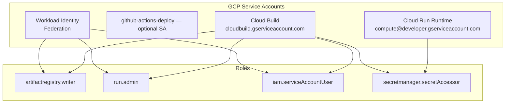
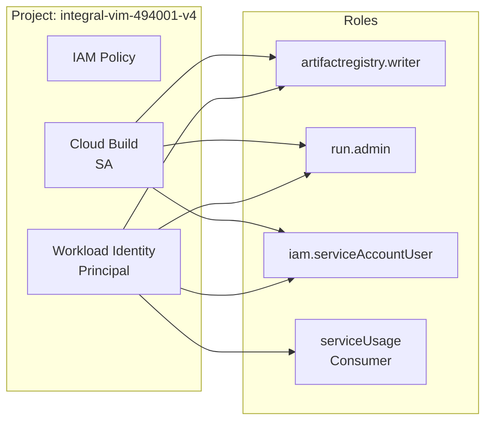

# IAM and Service Accounts Setup

This document details the Identity and Access Management (IAM) configuration required for the CI/CD pipeline.

---

## Service Accounts Overview



---

## Service Account Details

### 1. Workload Identity (No Service Account Key)

The GitHub Actions workflow uses **direct Workload Identity Federation**. No service account key is stored in GitHub.

**Authentication Flow:**
1. GitHub Actions generates an OIDC token
2. Token is sent to GCP Security Token Service (STS)
3. STS exchanges it for a GCP access token
4. GCP credentials are used for API calls

**Principal Format:**
```
principal://iam.googleapis.com/projects/395887947282/locations/global/workloadIdentityPools/github/subject/repo:godie007/fastapi-supabase-gcp-challenge:ref:refs/heads/main
```

### 2. GitHub Actions Deploy (Optional)

Used for local CLI operations, not required for GitHub Actions.

| Property | Value |
|----------|-------|
| Email | `github-actions-deploy@integral-vim-494001-v4.iam.gserviceaccount.com` |
| Display Name | GitHub Actions → Cloud Build submit |
| Purpose | Manual `gcloud builds submit` operations |
| Disabled | No (Active) |

### 3. Cloud Run Runtime Service Account

| Property | Value |
|----------|-------|
| Email | `395887947282-compute@developer.gserviceaccount.com` |
| Display Name | Default Compute Service Account |
| Purpose | Executes containers in Cloud Run |
| Default | Yes (system-created) |

### 4. Cloud Build Service Account

| Property | Value |
|----------|-------|
| Email | `395887947282@cloudbuild.gserviceaccount.com` |
| Purpose | Executes Cloud Build triggers |
| System-created | Yes |

---

## IAM Roles Required

### For Workload Identity Principal

Add these roles to the federated principal:

```bash
#!/bin/bash
# Script to add IAM roles to Workload Identity principal

PROJECT_ID="integral-vim-494001-v4"
PROJECT_NUMBER="395887947282"
POOL_PATH="projects/${PROJECT_NUMBER}/locations/global/workloadIdentityPools/github"
PRINCIPAL="principal://${POOL_PATH}/subject/repo:godie007/fastapi-supabase-gcp-challenge:ref:refs/heads/main"

# Role assignments
declare -a ROLES=(
    "roles/artifactregistry.writer"
    "roles/run.admin"
    "roles/iam.serviceAccountUser"
    "roles/iam.serviceAccountTokenCreator"
    "roles/cloudbuild.builds.editor"
    "roles/serviceusage.serviceUsageConsumer"
    "roles/storage.objectAdmin"
)

for ROLE in "${ROLES[@]}"; do
    echo "Adding $ROLE..."
    gcloud projects add-iam-policy-binding "$PROJECT_ID" \
        --member="$PRINCIPAL" \
        --role="$ROLE"
done
```

### Role Details

| Role | Permission Description |
|------|----------------------|
| `roles/artifactregistry.writer` | Create and push Docker images to Artifact Registry |
| `roles/run.admin` | Create, update, and delete Cloud Run services |
| `roles/iam.serviceAccountUser` | Act as (impersonate) service accounts |
| `roles/iam.serviceAccountTokenCreator` | Create tokens for service accounts |
| `roles/cloudbuild.builds.editor` | Create and run Cloud Build builds |
| `roles/serviceusage.serviceUsageConsumer` | Use Google Cloud APIs |
| `roles/storage.objectAdmin` | Read/write Cloud Storage objects |

### For Cloud Build Service Account

```bash
# Add roles to Cloud Build SA
gcloud projects add-iam-policy-binding "integral-vim-494001-v4" \
    --member="serviceAccount:395887947282@cloudbuild.gserviceaccount.com" \
    --role="roles/run.admin"

gcloud projects add-iam-policy-binding "integral-vim-494001-v4" \
    --member="serviceAccount:395887947282@cloudbuild.gserviceaccount.com" \
    --role="roles/artifactregistry.writer"

gcloud projects add-iam-policy-binding "integral-vim-494001-v4" \
    --member="serviceAccount:395887947282@cloudbuild.gserviceaccount.com" \
    --role="roles/iam.serviceAccountUser"

gcloud projects add-iam-policy-binding "integral-vim-494001-v4" \
    --member="serviceAccount:395887947282@cloudbuild.gserviceaccount.com" \
    --role="roles/secretmanager.secretAccessor"
```

### For Cloud Run Runtime SA

```bash
# Add secret accessor role
gcloud secrets add-iam-policy-binding "fastapi-supabase-gcp-challenge" \
    --project="integral-vim-494001-v4" \
    --member="serviceAccount:395887947282-compute@developer.gserviceaccount.com" \
    --role="roles/secretmanager.secretAccessor"
```

---

## Workload Identity Federation Setup

### 1. Create Workload Identity Pool

```bash
gcloud iam workload-identity-pools create github \
    --location="global" \
    --project="integral-vim-494001-v4" \
    --display-name="GitHub Actions"
```

### 2. Create OIDC Provider

```bash
gcloud iam workload-identity-pools providers create oidc github-actions \
    --location="global" \
    --workload-identity-pool="github" \
    --project="integral-vim-494001-v4" \
    --issuer-uri="https://token.actions.githubusercontent.com" \
    --attribute-mapping="google.subject=assertion.sub,attribute.repository=assertion.repository,attribute.repository_owner=assertion.repository_owner" \
    --attribute-condition="assertion.sub != ''"
```

### 3. Allow GitHub to Use the Pool

```bash
# For specific repository
gcloud iam workload-identity-pools providers add-oidc-iam-policy github-actions \
    --location="global" \
    --workload-identity-pool="github" \
    --project="integral-vim-494001-v4" \
    --member="principalSet://iam.googleapis.com/projects/395887947282/locations/global/workloadIdentityPools/github/attribute.repository/godie007/fastapi-supabase-gcp-challenge" \
    --role="roles/iam.workloadIdentityPoolUser"
```

### Provider Attribute Mapping

| GitHub Claim | GCP Attribute | Usage |
|-------------|--------------|-------|
| `sub` | `google.subject` | Exact subject matching |
| `repository` | `attribute.repository` | Repository name |
| `repository_owner` | `attribute.repository_owner` | Owner/org name |
| `actor` | `attribute.actor` | GitHub user |
| `ref` | `attribute.ref` | Branch/ref |

### Attribute Condition

The attribute condition prevents tokens from repositories that don't meet criteria:

```bash
# Recommended (permissive)
assertion.sub != ''

# Strict (optional)
assertion.repository == 'godie007/fastapi-supabase-gcp-challenge'
```

---

## IAM Policy Binding Examples

### Project-Level Bindings



### View Current IAM Policy

```bash
gcloud projects get-iam-policy integral-vim-494001-v4 \
    --format=yaml
```

### Add Principal to Role

```bash
# Using principal (exact subject match)
gcloud projects add-iam-policy-binding "integral-vim-494001-v4" \
    --member="principal://iam.googleapis.com/projects/395887947282/locations/global/workloadIdentityPools/github/subject/repo:godie007/fastapi-supabase-gcp-challenge:ref:refs/heads/main" \
    --role="roles/artifactregistry.writer"

# Using principalSet (attribute-based)
gcloud projects add-iam-policy-binding "integral-vim-494001-v4" \
    --member="principalSet://iam.googleapis.com/projects/395887947282/locations/global/workloadIdentityPools/github/attribute.repository/godie007/fastapi-supabase-gcp-challenge" \
    --role="roles/artifactregistry.writer"

# Using service account
gcloud projects add-iam-policy-binding "integral-vim-494001-v4" \
    --member="serviceAccount:395887947282-compute@developer.gserviceaccount.com" \
    --role="roles/secretmanager.secretAccessor"
```

---

## Security Best Practices

### 1. Use Workload Identity Instead of Service Account Keys

- No long-lived credentials stored in GitHub
- Credentials expire automatically
- Can restrict by repository or branch

### 2. Principle of Least Privilege

- Only grant necessary roles
- Use specific principal bindings instead of broad ones
- Regularly audit IAM policies

### 3. Attribute-Based Access

Use `principalSet` for broader access:

```bash
# Repository owner level
principalSet://iam.googleapis.com/.../attribute.repository_owner/godie007
```

Use `principal` for exact branch matching:

```bash
# Specific branch only
principal://iam.googleapis.com/.../subject/repo:org/repo:ref:refs/heads/main
```

### 4. Audit and Monitor

```bash
# View who has access to a role
gcloud projects get-iam-policy integral-vim-494001-v4 \
    --flatten="bindings[].members" \
    --filter="bindings.role:roles/run.admin"

# View workload identity pool access
gcloud iam workload-identity-pools get-iam-policy github \
    --location="global" \
    --project="integral-vim-494001-v4"
```

---

## Troubleshooting IAM Issues

### Error: Permission 'iam.serviceAccounts.getAccessToken' denied

This occurs when using service account impersonation without proper roles.

**If using direct WIF (no impersonation)**: This error should not occur.

**If using impersonation**: Add these roles to the WIF principal or SA:

```bash
# For impersonation
gcloud projects add-iam-policy-binding "integral-vim-494001-v4" \
    --member="principal://iam.googleapis.com/projects/395887947282/locations/global/workloadIdentityPools/github/subject/repo:..." \
    --role="roles/iam.workloadIdentityUser"

gcloud projects add-iam-policy-binding "integral-vim-494001-v4" \
    --member="principal://iam.googleapis.com/projects/395887947282/locations/global/workloadIdentityPools/github/subject/repo:..." \
    --role="roles/iam.serviceAccountTokenCreator"
```

### Error: Invalid principal member

The principal format is incorrect. Use:

```bash
# For exact subject
principal://iam.googleapis.com/projects/{PROJECT_NUMBER}/locations/global/workloadIdentityPools/{POOL}/subject/repo:org/repo:ref:refs/heads/main

# For attribute-based
principalSet://iam.googleapis.com/projects/{PROJECT_NUMBER}/locations/global/workloadIdentityPools/{POOL}/attribute.repository/org/repo
```

### Error: Policy modification failed

Use `--condition=None` flag:

```bash
gcloud projects add-iam-policy-binding "project-id" \
    --member="principal://..." \
    --role="roles/..." \
    --condition=None
```

---

## Summary

| Identity | Type | Roles |
|-----------|------|-------|
| GitHub Actions (WIF) | Federated Principal | `artifactregistry.writer`, `run.admin`, `iam.serviceAccountUser` |
| GitHub Actions Deploy SA | Service Account | (Optional, for local CLI) |
| Cloud Build SA | Service Account | `run.admin`, `artifactregistry.writer`, `iam.serviceAccountUser`, `secretmanager.secretAccessor` |
| Cloud Run Runtime SA | Service Account | `secretmanager.secretAccessor` |