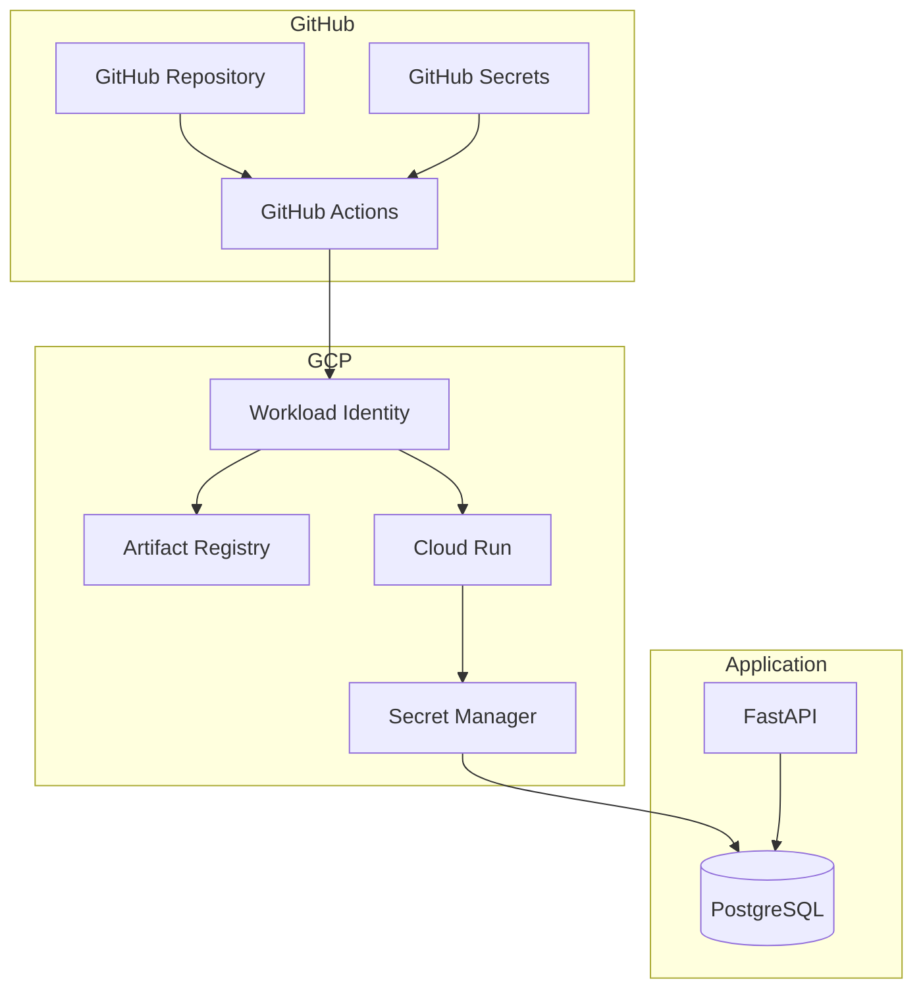

# Documentation Index

This folder contains comprehensive documentation for the FastAPI application architecture deployed on Google Cloud Platform.

---

## Quick Links

- **REST API reference (Spanish)**: [API.md](API.md)
- **GCP deployment summary (Spanish)**: [GCP-DEPLOY.md](GCP-DEPLOY.md)
- **Architecture Overview**: [ARCHITECTURE.md](ARCHITECTURE.md)
- **IAM Setup**: [IAM-SETUP.md](IAM-SETUP.md)
- **Secrets Management**: [SECRETS-MANAGEMENT.md](SECRETS-MANAGEMENT.md)
- **Cloud Run**: [CLOUD-RUN.md](CLOUD-RUN.md)
- **CI/CD Workflow**: [CICD-WORKFLOW.md](CICD-WORKFLOW.md)

---

## Architecture Summary

---

## Documentation Map

### 0. [API.md](API.md) (Spanish)

REST resource reference: endpoints, status codes, pagination, error payload shapes, and how to use OpenAPI tooling.

**Best for**: API consumers and reviewers (non-code narrative in Spanish)

---

### 0b. [GCP-DEPLOY.md](GCP-DEPLOY.md) (Spanish)

High-level GCP checklist: enabled APIs, Artifact Registry, secrets, IAM for Cloud Build → Cloud Run.

**Best for**: First-time deploy and onboarding in Spanish

---

### 1. [ARCHITECTURE.md](ARCHITECTURE.md)

Complete system architecture including:
- High-level architecture diagram
- CI/CD pipeline flow
- All GCP components
- API endpoints
- Troubleshooting guide

**Best for**: Understanding the complete system

---

### 2. [IAM-SETUP.md](IAM-SETUP.md)

Identity and Access Management:
- Service account details
- IAM roles and permissions
- Workload Identity Federation setup
- Principal binding examples
- Security best practices

**Best for**: Configuring and auditing IAM

---

### 3. [SECRETS-MANAGEMENT.md](SECRETS-MANAGEMENT.md)

Secrets configuration:
- GitHub secrets setup
- Secret Manager usage
- Passing secrets to Cloud Run
- Secret rotation procedures
- Security best practices

**Best for**: Managing sensitive configuration

---

### 4. [CLOUD-RUN.md](CLOUD-RUN.md)

Cloud Run deployment:
- Service configuration
- Dockerfile details
- Deployment commands
- Traffic management
- Scaling configuration
- Cost optimization

**Best for**: Cloud Run operations

---

### 5. [CICD-WORKFLOW.md](CICD-WORKFLOW.md)

GitHub Actions workflow:
- Workflow file structure
- Step-by-step execution
- Trigger conditions
- Monitoring and debugging
- Security considerations

**Best for**: CI/CD pipeline management

---

## Key Components

| Component | Description | Documentation |
|-----------|-------------|----------------|
| **FastAPI** | REST API framework | External |
| **PostgreSQL** | Database (Supabase) | External |
| **GitHub Actions** | CI/CD | [CICD-WORKFLOW.md](CICD-WORKFLOW.md) |
| **Workload Identity** | GCP Authentication | [IAM-SETUP.md](IAM-SETUP.md) |
| **Artifact Registry** | Container registry | [ARCHITECTURE.md](ARCHITECTURE.md) |
| **Cloud Run** | Serverless platform | [CLOUD-RUN.md](CLOUD-RUN.md) |
| **Secret Manager** | Secrets storage | [SECRETS-MANAGEMENT.md](SECRETS-MANAGEMENT.md) |

---

## Quick Start Checklist

### Prerequisites

- [ ] GitHub repository created
- [ ] GCP project available
- [ ] Supabase/PostgreSQL configured

### Setup Steps

1. **Configure GitHub Secrets**
   - `GCP_PROJECT_ID`
   - `GCP_WORKLOAD_IDENTITY_PROVIDER`

2. **Configure GCP**
   - Enable APIs
   - Create Artifact Registry
   - Create Secret in Secret Manager
   - Assign IAM roles

3. **Deploy**
   - Push to `main` branch
   - Tests run automatically
   - Deployment triggers on success

4. **Verify**
   - Check Cloud Run service URL
   - Test API endpoints

---

## Common Tasks

| Task | Documentation |
|------|---------------|
| Change deployment region | [CICD-WORKFLOW.md](CICD-WORKFLOW.md) |
| Update IAM permissions | [IAM-SETUP.md](IAM-SETUP.md) |
| Rotate DATABASE_URL secret | [SECRETS-MANAGEMENT.md](SECRETS-MANAGEMENT.md) |
| Scale Cloud Run instances | [CLOUD-RUN.md](CLOUD-RUN.md) |
| Debug workflow failures | [CICD-WORKFLOW.md](CICD-WORKFLOW.md) |

---

## External Resources

- [FastAPI Documentation](https://fastapi.tiangolo.com/)
- [Google Cloud Run Documentation](https://cloud.google.com/run/docs)
- [GitHub Actions Documentation](https://docs.github.com/en/actions)
- [Workload Identity Federation](https://cloud.google.com/iam/docs/workload-identity-federation)
- [Secret Manager Documentation](https://cloud.google.com/secret-manager/docs)
- [Artifact Registry Documentation](https://cloud.google.com/artifact-registry/docs)

---

## Support

For issues or questions:
1. Check the troubleshooting sections in each document
2. Review GitHub Actions workflow logs
3. Check Cloud Run logs in GCP Console
4. Verify IAM permissions